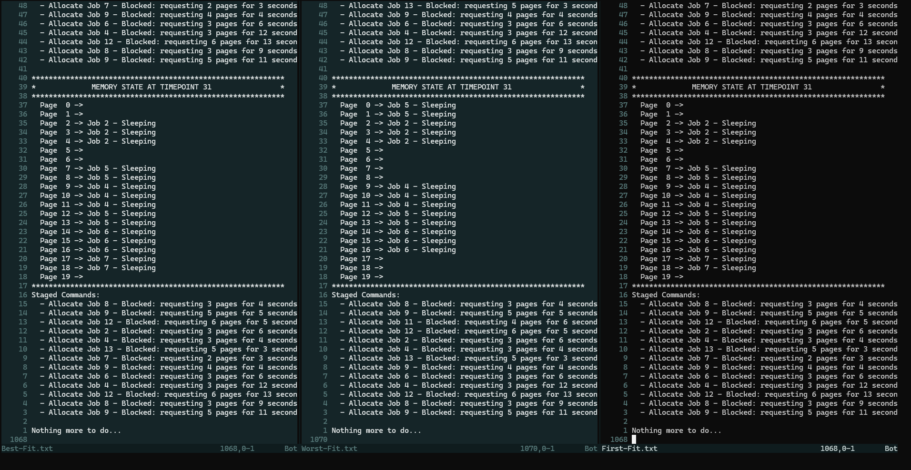
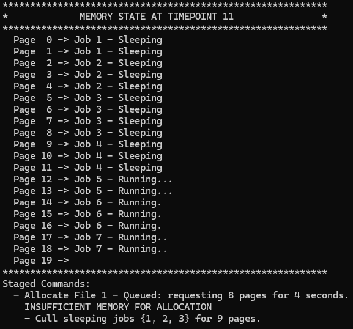

# Computer Science 305 via Study.com - Assignment 1: Solving Memory Management Problems
> Assignment Prompt answers may be found in the [Answers](#Answers) section.

## Required Tooling

> The project expects a Linux environment, tested in Ubuntu 24.04.3 LTS via WSL and Arch.

### CMake
- *CMake is the de-facto standard for building C++ code.* - [CMake.org](https://cmake.org/)
- Tested with version 4.2.1

### GCC
- *The GNU Compiler Collection includes front ends for C, C++, Objective-C, Fortran, Ada, Go, D, Modula-2, and COBOL as well as libraries for these languages (libstdc++,...).* - [gcc.gnu.org](https://gcc.gnu.org/)
- Tested with version 15.2

## Build Instructions

> Build and run automatically.
1. Clone the repository.
1. Run the build script: `./run.sh`

> Build and run manually. 
1. Clone the repository.
1. Create a build directory: `cmake -B build`
1. Build the project: `cmake --build build`
1. Run the application with the appropriate flag: `./build/bin/assignment1 <--flag>`

#### Flags

- `First-Fit`
- `Best-Fit`
- `Worst-Fit`
- > Usage example: `./build/bin/assignment1 --First-Fit`

## Output

When running with the included `run.sh` shell script, the program will be executed once for each memory allocation algorithm.  The output of each pass will be saved to a `.txt` file in the `output` directory as shown below.
- `First-Fit.txt`
- `Best-Fit.txt`
- `Worst-Fit.txt`

Remaining execution time for running jobs is described by the number of `.` characters following the job state.  For example, a running job with 3 seconds of execution left is represented by `Running...`.

# Answers

The image below shows the output for each algorithm in a side-by-side comparison, algorithms are described at the bottom of the editor.  This was done using the skip method, where a job that could not be allocated was moved to a `Blocked` state and ignored.  This method showed the greatest differences in the algorithms given the table of inputs provided.  We see larger fragmentation blocks out of the Worst-Fit example, with more memory wasted overall.  First-Fit and Best-Fit show smaller blocks of internal fragmentation and better overall memory usage.  Interestingly, all 3 algorithms completed he same amount of jobs given the example input, but First-Fit and Best-Fit skip Job 11, where Worst-Fit skips job 7.  I'm not quite sure if this is all I'm supposed to do based on my attempt at interpreting the instructions, replacement is mentioned, but I'm unsure if we are expected to replace sleeping jobs or what exactly.  Also not sure what pages they would be replaced with, maybe we're supposed to split the 20 pages into smaller sections?  Honestly not sure based on the vagueness of the instructions as I'm reading them.  So far as a Windows vs Linux comparison, I would be curious to see how the Buddy Algorithm that Linux uses would compare to these three algorithms given the sample input.  A lot of what I'm reading talks about increased internal fragmentation due to the splitting of memory blocks, some sources state that it either works very well, or very poorly given different context.

